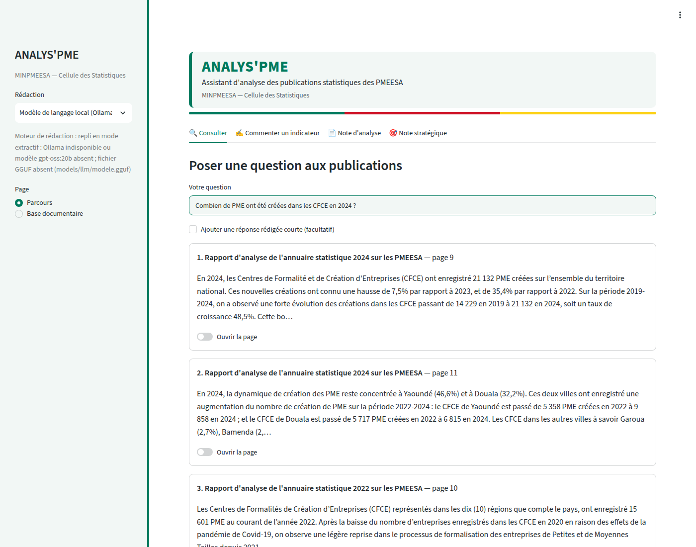
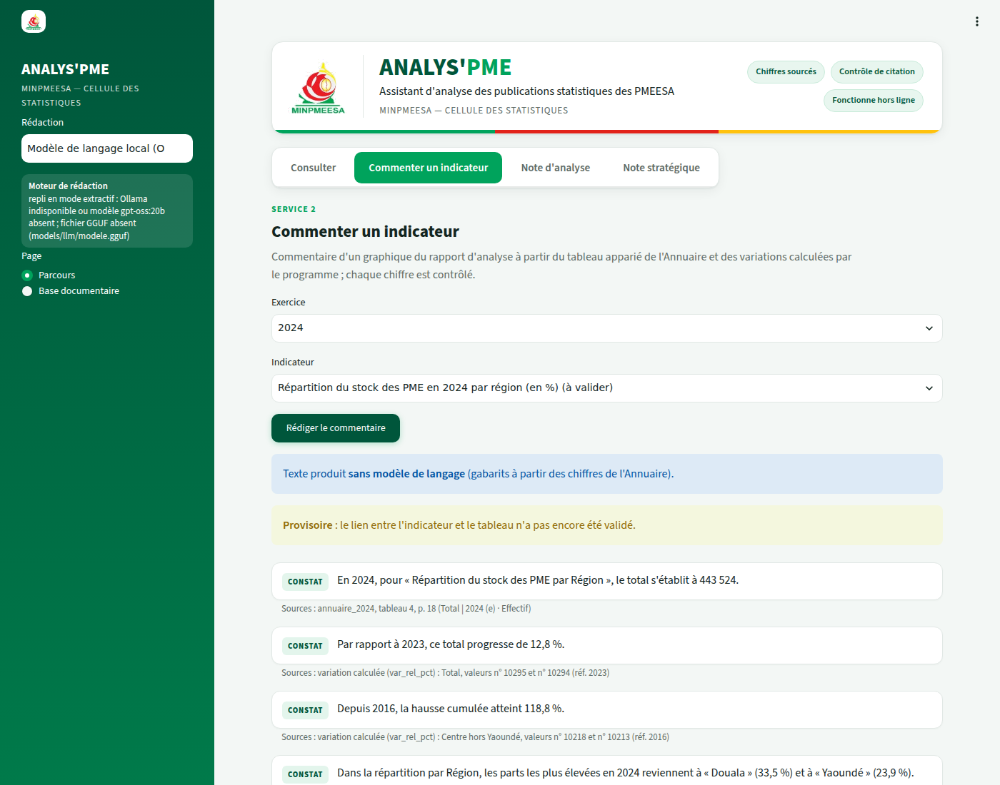
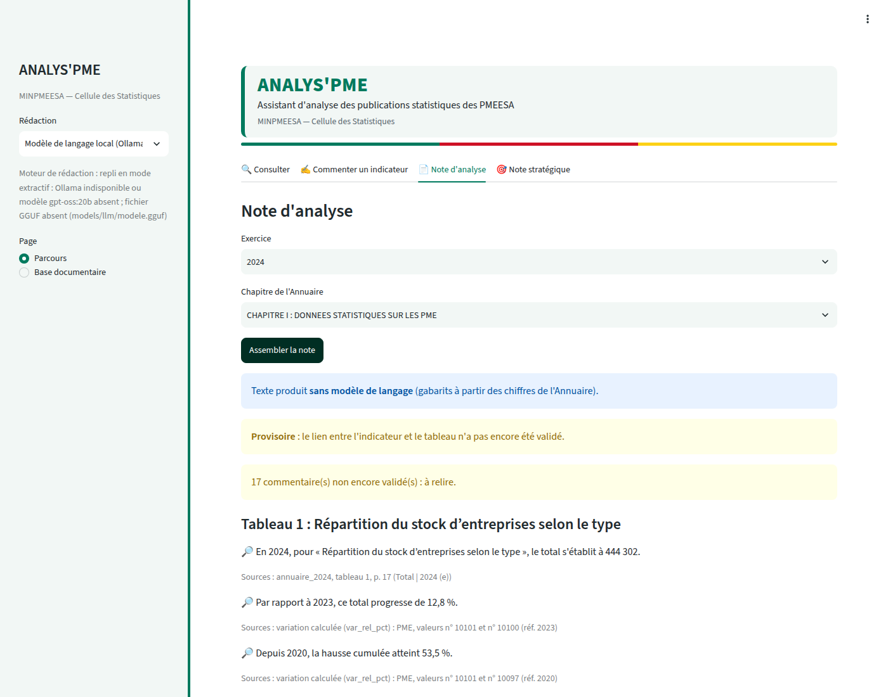
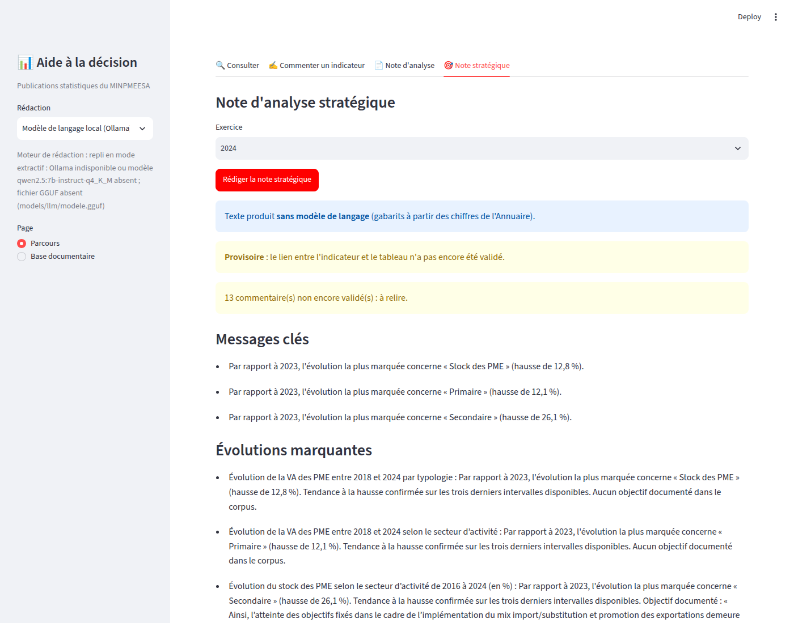

# Guide de l'utilisateur

Lancer l'outil : double-clic sur `demarrer.bat`. Dans la barre de gauche, **Rédaction** permet de choisir
entre « Modèle de langage local » et « Sans modèle de langage » (gabarits). Le moteur effectivement
utilisé est affiché juste en dessous.

Trois messages peuvent accompagner les textes :
- **Sans modèle de langage** : le texte vient de gabarits appliqués aux chiffres de l'Annuaire ;
- **Provisoire** : le lien entre l'indicateur et le tableau n'est pas encore validé ;
- **Non validé** : le commentaire n'a pas encore été relu et validé par la Cellule.

## 1. Consulter

1. Tapez une question en français, puis Entrée.
2. Les 5 passages les plus utiles s'affichent, avec le titre du document, la page et un extrait.
3. « Ouvrir la page » affiche la page du PDF d'origine.
4. Si rien de solide n'est trouvé : « Aucune source suffisante trouvée dans les publications ».
   Les documents à usage interne ne sont jamais montrés.

## 2. Commenter un indicateur

1. Choisissez l'exercice et l'indicateur, puis « Rédiger le commentaire ».
2. Chaque phrase est suivie de ses **sources** (tableau, page ; ou variation calculée et ses deux valeurs).
3. « Valeurs écartées » liste les chiffres retirés, parce qu'ils ne figuraient pas dans les sources.
4. Sans source suffisante : « sources insuffisantes, à commenter manuellement ».
5. Relisez, puis **« Valider ce commentaire »** : seuls les commentaires validés sont repris dans les notes.
6. « Exporter en Word ».

## 3. Note d'analyse

1. Choisissez l'Annuaire statistique (par exemple « Annuaire statistique 2024 »), puis l'étendue : l'Annuaire entier, ou seulement certains de ses chapitres ; cliquez sur « Rédiger la note d'analyse ».
2. La note reprend les commentaires, tableau par tableau, dans l'ordre de l'Annuaire. Elle n'ajoute aucun chiffre.
3. Les tableaux sans commentaire possible sont listés « à commenter manuellement ».
4. « Exporter en Word ».

## 4. Note stratégique

1. Choisissez l'exercice, puis « Rédiger la note stratégique ».
2. Rubriques : Messages clés (3), Évolutions marquantes, Points d'attention, Pistes pour la décision, Sources.
3. Chaque évolution est qualifiée : tendance sur trois exercices, ou variation ponctuelle. Un objectif de
   politique publique n'est cité que s'il figure dans une publication, avec la page.
4. « Traçabilité » montre la chaîne énoncé → commentaire → valeur → tableau → page.
5. « Exporter en Word ».

## Base documentaire

La base est locale : `data/base/minpmeesa.sqlite` (documents, passages, valeurs, variations, appariements,
journal) et `data/base/minpmeesa.faiss` (index vectoriel des passages).

1. **Ajouter un PDF** : titre, type, exercice, trimestre, statut. Case « Intégrer tout de suite dans la base »
   cochée (par défaut) : le PDF est copié dans le corpus, inscrit au registre, puis la base SQLite + FAISS est
   reconstruite ; il est aussitôt interrogeable. Case décochée : il est seulement inscrit, et sera intégré au
   prochain clic sur « Reconstruire la base ».
2. **Explorer la base** : compteurs (documents, passages, vecteurs FAISS, valeurs, variations, appariements) et
   onglets Documents, Passages (filtre par document, recherche de mots), Valeurs (par document et tableau),
   Variations (par indicateur), Appariements, Journal des productions.
3. Hors de l'interface, le fichier `minpmeesa.sqlite` s'ouvre avec DB Browser for SQLite (lecture seule
   conseillée).
